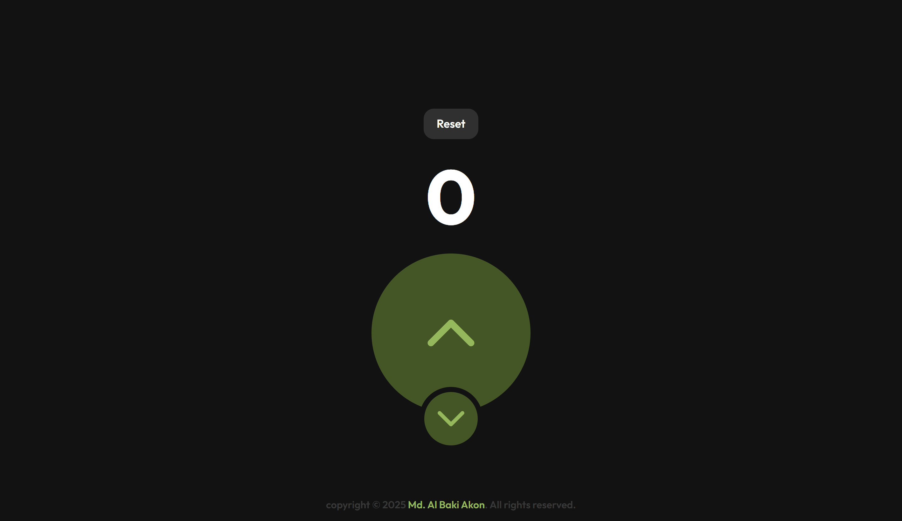
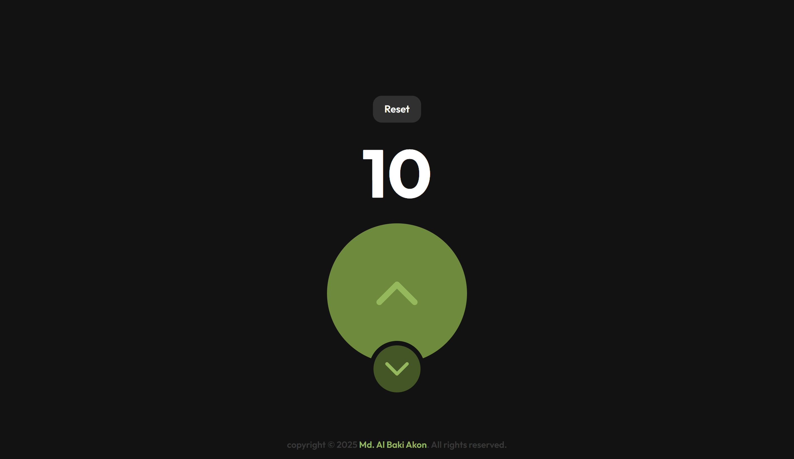

# Tasbih - React Counter Project

A **modern, responsive, and interactive counter app** built with React and TailwindCSS. Features include clickable increment and decrement buttons with press animations, and a custom footer. Perfect for learning state management, component reuse, and UI animations.

---

## Project Live Demo

[Live Demo](https://your-live-demo-url.com)

---

## Features

- Increment and decrement counter
- Prevents negative counts
- Press animation with smooth background flash
- Reusable **UpperButton** and **LowerButton** components
- TailwindCSS responsive styling
- Clean, modern UI design
- Footer with professional copyright

---

##  Project Screenshots 

**Initial State:**



**After Clicking Upper Button:**



**After Clicking Lower Button:**


---

## 🛠️ Tech Stack

- **React 18+** – Component-based UI
- **TailwindCSS 3+** – Modern styling
- **Lucide Icons** – Clean vector icons
- **Vite / Create React App** – Fast development environment

---

## ⚡ Installation

1. **Clone the repo**
```bash
git clone https://github.com/mdalbakiakon/tasbih.git
cd tasbih
npm install
npm run dev
http://localhost:5173